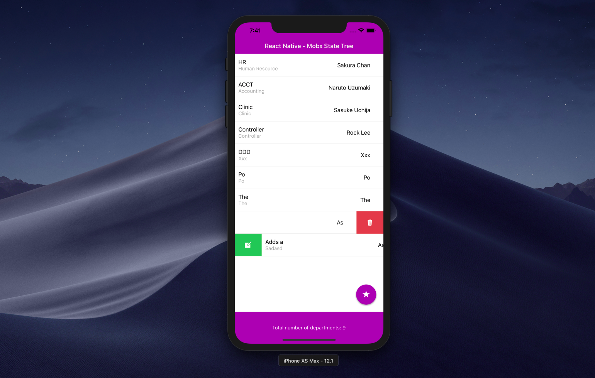

# React Native Boot Camp Training Day 2 - React Native - Mobx 

#Office App React Native app Office App React Native version using CRUD operation (create, read, update, delete), HTTP client (axios), and Mobx as the state management tool

# Run npm run backend before running npm start. Please see package.json

